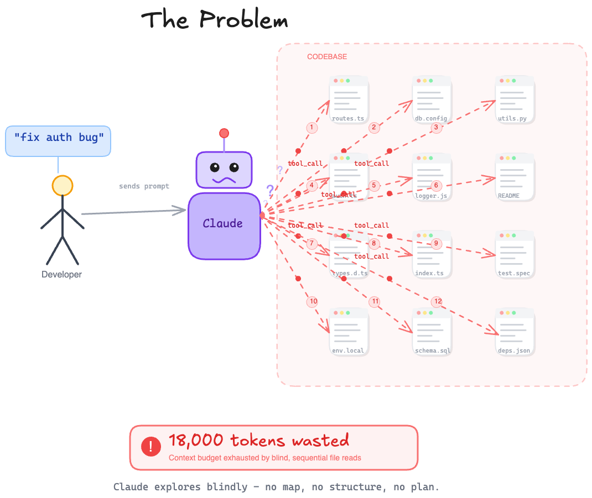
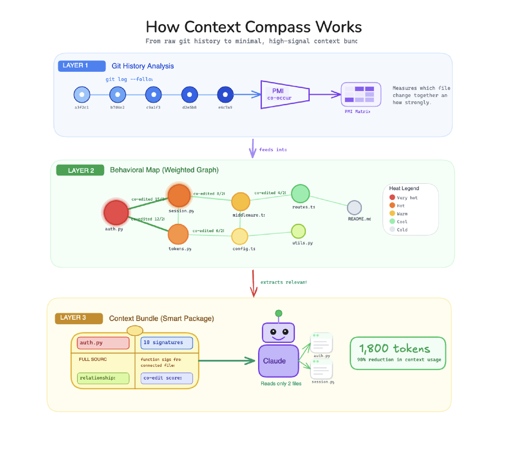
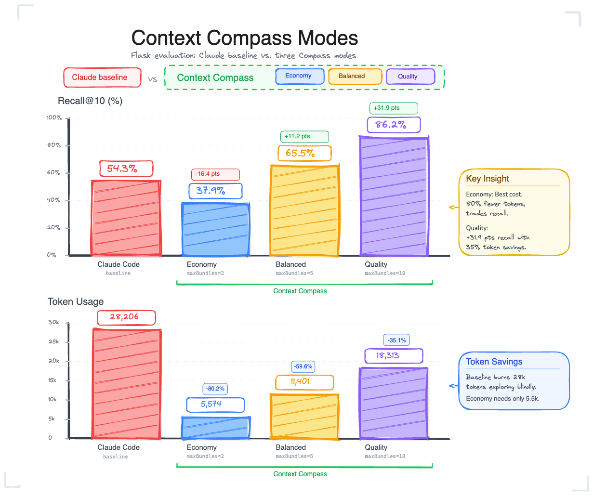

# Context Compass

[](https://github.com/X1NPAR1/context-compass/actions/workflows/ci-matrix.yml)
[](https://github.com/X1NPAR1/context-compass/actions/workflows/release-gate.yml)
[](https://modelcontextprotocol.io/)
[](https://code.claude.com/)
[](https://github.com/X1NPAR1/context-compass/discussions)
[](https://nodejs.org/)
[](https://github.com/X1NPAR1/context-compass/blob/main/LICENSE)
[](https://github.com/X1NPAR1/context-compass#desteklenen-diller)

**Context Compass**, Claude Code için davranışsal kod ilişkilerini git geçmişinden önceden hesaplayan bir CLI çatısıdır. Böylece Claude, kodunuzda daha az bağlam (context) israfıyla ve daha yüksek isabet oranıyla gezinir.

> Kısaca: "Bu görev için hangi dosyalar gerçekten gerekli?" sorusunu, kodun yapısal bağlantılarına değil, **gerçek değişiklik alışkanlıklarınıza** (git co-edit geçmişi) bakarak yanıtlar.

---

## İçindekiler

- [Neden Context Compass?](#neden-context-compass)
- [Nasıl Çalışır?](#nasıl-çalışır)
- [Temel Kavramlar](#temel-kavramlar)
- [Çalışma Modları](#çalışma-modları)
- [Değerlendirme Sonuçları](#değerlendirme-sonuçları)
- [Kurulum](#kurulum)
- [Gereksinimler](#gereksinimler)
- [Hızlı Başlangıç](#hızlı-başlangıç)
- [Komutlar](#komutlar)
- [Mimari](#mimari)
- [Gizlilik](#gizlilik)
- [Desteklenen Diller](#desteklenen-diller)
- [Katkıda Bulunma](#katkıda-bulunma)
- [Geri Bildirim](#geri-bildirim)
- [Sürüm Kontrolü](#sürüm-kontrolü)
- [Güvenlik](#güvenlik)
- [Lisans](#lisans)

---

## Beta

Context Compass şu anda **beta** aşamasındadır.

- Birincil hedef: **Yalnızca Claude Code**
- API'ler, davranış ve çıktı formatı beta süresince değişebilir
- Hem olumlu hem de yapıcı geri bildirimleri memnuniyetle karşılıyoruz

### Mevcut Kapsam

Bugün Context Compass, Claude Code için optimize edilmiştir. Diğer araçların (Cursor, Windsurf, Antigravity, Codex) desteği, Claude Code yolu tamamen sağlamlaştırıldıktan sonra planlanmaktadır.

---

## Neden Context Compass?

### Problem

Claude tarzı kodlama akışları, gerçekten ilgili fonksiyonlara ulaşmadan önce **kör (blind) sıralı dosya keşfine** çok fazla bağlam bütçesi harcayabilir. Model, doğru dosyayı bulana kadar onlarca dosyayı okur, bu da:

- Daha yüksek token maliyeti,
- Daha yavaş ilk yanıt,
- Ve alakasız bağlam yüzünden düşen isabet oranı

ile sonuçlanır.



### Çözüm

Context Compass, kod tabanınızı önceden analiz eder ve "hangi fonksiyonlar birlikte değişiyor?" sorusunun cevabını istatistiksel olarak çıkarır. Claude bir göreve başladığında, geniş bir keşif yapmak yerine **yüksek sinyalli, derli toplu bağlam paketleriyle** işe başlar.

---

## Nasıl Çalışır?

Context Compass; sembolleri/çağrıları/import'ları ayrıştırır, git oturumlarından co-edit (birlikte değişme) bağlaşımını **PMI** ile öğrenir ve derli toplu bağlam paketlerini **MCP** üzerinden Claude'a sunar.



Akış üç ana aşamadan oluşur:

1. **İndeksleme** — Tree-sitter ile 10+ dilde fonksiyon/sınıf/metot sembolleri, çağrı grafiği ve import ilişkileri çıkarılır.
2. **Davranışsal öğrenme** — Git commit geçmişi taranır; aynı commit'te birlikte değişen fonksiyonlar "co-edit oturumları" olarak gruplanır ve aralarındaki ilişki gücü PMI ile puanlanır.
3. **Bağlam sunumu** — Claude bir istem gönderdiğinde, niyet (intent) sınıflandırılır ve göreve en uygun fonksiyonların bağlam paketleri MCP aracılığıyla sunulur.

---

## Temel Kavramlar

### PMI (Pointwise Mutual Information)

İki fonksiyonun rastgele şansa kıyasla ne sıklıkla **birlikte** değiştiğini ölçen istatistiksel bir metriktir:

```
PMI(A, B) = log2( P(A, B) / (P(A) × P(B)) )
```

- **Yüksek PMI** → Bu iki fonksiyon birbirine davranışsal olarak bağlı; biri değişince diğeri de sık değişiyor.
- **Düşük/negatif PMI** → Bağımsız değişen, ilgisiz kod parçaları.

### Bağlam Paketi (Context Bundle)

Her fonksiyon için, beş farklı ilişki türüne göre en yakın "komşular" toplanarak bir bağlam paketi oluşturulur:

| İlişki Türü | Anlamı |
|---|---|
| `CALLS` | Doğrudan fonksiyon çağrısı |
| `CALLED_BY` | Ters çağrı ilişkisi |
| `CO_EDIT` | Git geçmişinde birlikte değişme (PMI bağlaşımı) |
| `TEST` | İlgili test dosyaları ve bağlantıları |
| `CONFIG` | Konfigürasyon/sabit üzerinden davranışsal bağımlılık |

### Niyet Sınıflandırma (Intent Classification)

İstem metni analiz edilerek görev türü belirlenir: `bug_fix`, `feature`, `refactor`, `testing` veya `general`. Bu sınıflandırma, hangi ilişki türlerine ağırlık verileceğini etkiler.

---

## Çalışma Modları

Token maliyeti ile isabet oranı arasındaki dengeyi göreviniz için ayarlamak üzere alım (retrieval) modlarını kullanın.



| Mod | Paket Sayısı | Token Tasarrufu | Kullanım Senaryosu |
|---|---|---|---|
| **Economy** | `maxBundles=2` | En yüksek tasarruf (~5x) | Hızlı, basit görevler; token bütçesi kritikken |
| **Balanced** | `maxBundles=5` | Dengeli (~2.5x) | Günlük geliştirme için varsayılan denge |
| **Quality** | `maxBundles=10` | En yüksek isabet | Karmaşık görevler; maksimum doğruluk gerektiğinde |

Modu değiştirmek için:

```bash
context-compass mode quality
```

---

## Değerlendirme Sonuçları (Flask Held-Out)

Aşağıdaki tablo, Flask kod tabanı üzerinde tutulan (held-out) test setiyle elde edilen sonuçları gösterir:

| Yöntem | Recall@10 | Baseline'a Δ | Token | Azalma | X kat az |
|---|---:|---:|---:|---:|---:|
| Claude baseline | 54.3% | — | 28.206 | — | — |
| Economy (maxBundles=2) | 37.9% | -16.4 puan | 5.574 | %80.2 | 5.06x |
| Balanced (maxBundles=5) | 65.5% | +11.2 puan | 11.401 | %59.6 | 2.47x |
| Quality (maxBundles=10) | 86.2% | +31.9 puan | 18.313 | %35.1 | 1.54x |

Kendi deponuzda yeniden üretmek için:

```bash
context-compass eval
context-compass eval --json
```

---

## Kurulum

```bash
npm install -g context-compass
```

---

## Gereksinimler

- Node.js `>=20`
- [Claude Code](https://code.claude.com/) kurulu ve `claude` komutu olarak erişilebilir
- Bir git deposu (geçmiş ne kadar zenginse davranışsal alım kalitesi o kadar yüksek olur)

---

## Hızlı Başlangıç

```bash
cd projeniz
context-compass init
claude
```

`init` komutu; indeksi oluşturur ve MCP + SessionStart entegrasyonunu otomatik olarak yapılandırır. Bu noktadan sonra Claude Code, her oturumda otomatik olarak yalnızca ilgili bağlamı alır.

---

## Komutlar

| Komut | Açıklama |
|---|---|
| `context-compass` | Mevcut proje durumunu gösterir. |
| `context-compass init` | İndeksi oluşturur/yeniden oluşturur ve Claude entegrasyonunu kurar. |
| `context-compass serve` | MCP sunucusunu stdio üzerinden çalıştırır. |
| `context-compass install-mcp` | Proje `.mcp.json` dosyasını oluşturur/günceller. |
| `context-compass stats` | Proje + global tasarruf panosunu gösterir. |
| `context-compass savings` | `stats` için takma ad. |
| `context-compass eval [--json]` | Tutulan oturumlar üzerinde alım kalitesini değerlendirir. |
| `context-compass mode [economy\|balanced\|quality]` | Alım modunu gösterir/ayarlar. |
| `context-compass enable-hook` | Opsiyonel eski `UserPromptSubmit` yedeğini etkinleştirir. |
| `context-compass hook-session-start` | Dahili SessionStart hook komutu. |
| `context-compass hook-prompt` | Dahili yedek istem (prompt) hook komutu. |

---

## Mimari

```
src/
├── cli.ts                      # Commander tabanlı CLI giriş noktası
├── types.ts                    # Tüm TypeScript türleri ve arayüzleri
│
├── core/                       # Çekirdek motor
│   ├── indexer.ts              # Tam ve artımlı indeksleme orkestrasyonu
│   ├── parser.ts               # Tree-sitter tabanlı kod ayrıştırma
│   ├── git-analyzer.ts         # Git commit geçmişi analizi (co-edit oturumları)
│   ├── pmi.ts                  # PMI skorlama algoritması
│   ├── bundle-generator.ts     # Bağlam paketi oluşturma
│   └── context-retrieval.ts    # İstem bazlı bağlam alımı
│
├── commands/                   # CLI komutları
│   ├── init.ts                 # Proje tarama, DB kurulumu, Claude entegrasyonu
│   ├── serve.ts                # MCP sunucusu
│   ├── stats.ts                # Tasarruf istatistikleri
│   ├── eval.ts                 # Alım kalitesi değerlendirme
│   ├── mode.ts                 # Alım stratejisi yapılandırması
│   ├── install-mcp.ts          # .mcp.json yapılandırması
│   ├── enable-hook.ts          # Hook etkinleştirme
│   └── status.ts               # Durum bilgisi
│
├── hooks/ & hook/              # Claude Code olay kancaları (hooks)
│   ├── session-start.ts        # SessionStart olayı
│   └── prompt-interceptor.ts   # İstem yakalama (opsiyonel yedek)
│
└── utils/                      # Yardımcı modüller
    ├── db.ts                   # Veritabanı işlemleri (sql.js)
    ├── config.ts               # Proje yapılandırması
    ├── tokens.ts               # Token sayımı (js-tiktoken)
    ├── pricing.ts              # Maliyet hesaplama
    ├── savings-tracker.ts      # Tasarruf izleme
    └── ...                     # Diğer yardımcılar
```

### Teknoloji Yığını

| Katman | Teknoloji |
|---|---|
| Dil | TypeScript 5.8+ |
| Çalışma Zamanı | Node.js ≥20 |
| Kod Analizi | Tree-sitter (10+ dil) |
| Git İşlemleri | simple-git |
| AI Entegrasyonu | MCP (Model Context Protocol) |
| Veritabanı | sql.js |
| Token Sayımı | js-tiktoken |
| Dosya İzleme | chokidar |
| Test | Vitest |

---

## Gizlilik

Context Compass, indeks verilerini proje yerelinde `.context-compass/` altında saklar. Kodunuz dışarı gönderilmez.

Opsiyonel ortam değişkenleri:

- `CONTEXT_COMPASS_DISABLE_GLOBAL_STATS=1` — Kullanıcı düzeyinde, projeler arası tasarruf toplamasını devre dışı bırakır.
- `CONTEXT_COMPASS_ENABLE_GLOBAL_DOMAINS=1` — Global istatistiklerde projeler arası alan (domain) toplamasını etkinleştirir (varsayılan: kapalı).
- `CONTEXT_COMPASS_HOME=/özel/yol` — Kullanıcı düzeyindeki Context Compass dosyalarının saklandığı yeri değiştirir (varsayılan: `~/.context-compass`).

---

## Desteklenen Diller

Mevcut destek: **Python, TypeScript, JavaScript, Go, Rust, Java, C#, Ruby, PHP, Kotlin.**

Daha fazla dil desteğine yönelik yol haritası ayrıntıları önümüzdeki ay yayınlanacaktır. Belirli bir dile mi ihtiyacınız var? [Dil isteği oluşturun](https://github.com/X1NPAR1/context-compass/issues/new/choose).

---

## Katkıda Bulunma

Katkıda bulunmak ister misiniz? [CONTRIBUTING.md](CONTRIBUTING.md) ile başlayın ve [CODE_OF_CONDUCT.md](CODE_OF_CONDUCT.md) belgesini de gözden geçirin.

PR öncesi zorunlu doğrulama:

```bash
npm run ci:verify
```

---

## Geri Bildirim

Bir hata veya beklenmedik bir davranışla karşılaşırsanız lütfen bir issue açın:

- [Issue aç](https://github.com/X1NPAR1/context-compass/issues/new/choose)

Context Compass iyi (veya kötü) çalışıyorsa, sonuçlarınızı Tartışmalar (Discussions) altındaki **Feedback** kategorisinde paylaşın:

- [GitHub Discussions](https://github.com/X1NPAR1/context-compass/discussions)

Paylaşırken faydalı ayrıntılar:

- `context-compass savings`
- `context-compass eval --json`
- Depo boyutu ve seçili mod (`economy`, `balanced`, `quality`)
- Neyin iyileştiği ve hâlâ neyin geliştirilmesi gerektiği

---

## Sürüm Kontrolü

```bash
npm run release:check
```

Bu komut; typecheck, güvenlik denetimi (`npm audit --omit=dev`) ve npm paketi kuru çalıştırmasını (dry-run) gerçekleştirir.

---

## Güvenlik

Güvenlik açığı bildirimi için [SECURITY.md](SECURITY.md) dosyasına bakın.

---

## Lisans

Apache License 2.0. Ayrıntılar için [LICENSE](LICENSE) dosyasına bakın.
